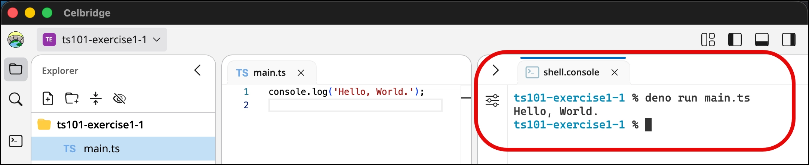
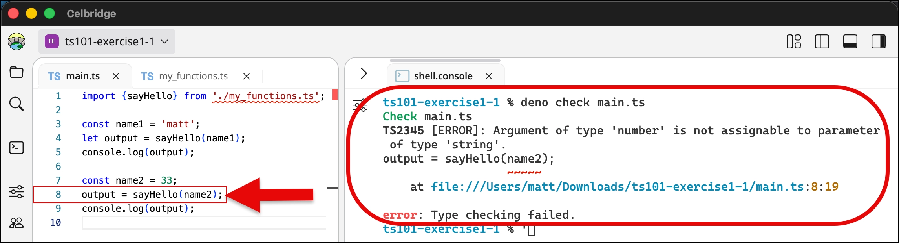
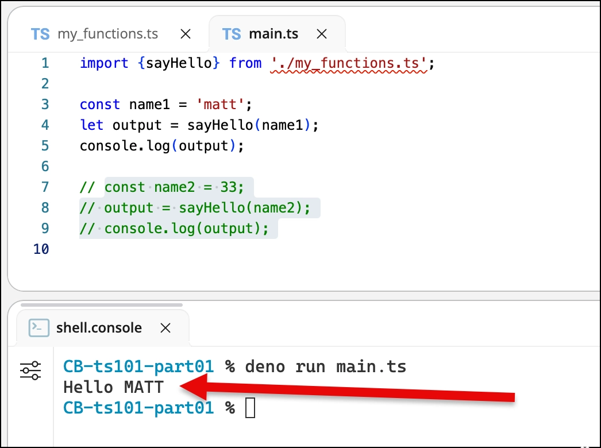

# TypeScript 101 - part 01 - Set up a TS project, run main and typecheck a function call

> This README uses **Deno**. No Deno on your computer (e.g. the college lab PCs)?
> Use [README_node.md](README_node.md) instead - it's the same exercises, with Node commands.
>
> See [README_deno_TS_workflow.md](README_deno_TS_workflow.md) for a summary of the Deno commands.

## Exercise 1-1: Install deno

Do the following:

1. install the **deno** TypeScript runtime on your system:

https://deno.com/


NOTE:
- I'm assuming you are using **deno** for your TypeScript projects

- you could also be using **Node** (v26 or later) - in which case follow [README_node.md](README_node.md) instead,
  which is the same exercises, with Node commands

## Exercise 1-2: test your deno setup

Do the following:


1. create a new project
   - e.g. create a new empty Celbridge project


1. create (and open) a Celbridge console document
   <br>
(or open some other CLI terminal on your system)

  - e.g I usually create a simple console document named `shell.console`
    - no settings need to be changed for the default console document


2. test **deno** at the command line

```bash
deno -v      
```

TERMINAL DUMP:
```bash
$ deno -v      
deno 2.9.6
```

3. test **deno** at the command line, to also show TypeScript version:

```bash
deno --version
```

TERMINAL DUMP:
```bash
$ deno --version
deno 2.9.6 (stable, release, aarch64-apple-darwin)
v8 15.0.245.2-rusty
typescript 6.0.3
```

## Exercise 1-3: Create hello world TypeScript project

1. create (and open) file `main.ts` containing the following:

```ts
console.log('Hello, World.');
```


2. test your script with **deno**:

```bash
deno run main.ts
```

TERMINAL DUMP:
```bash
$ deno run main.ts
Hello, World.
```



## Exercise 1-4: Test type checking with a function

1. create (and open) file `my_functions.ts` containing the following function `sayHello(<string>)`:

```ts
// my_functions.ts
export function sayHello(name: string): string {
    return "Hello " + name.toUpperCase();
}
```


2. Edit `main.ts` to call the function with a string, then a number:

```ts
// main.ts
import {sayHello} from './my_functions.ts';

const name1 = 'matt';
let output = sayHello(name1);
console.log(output);

const name2 = 33;
output = sayHello(name2);
console.log(output);
```


3. get **deno** to check the scripts:

```bash
deno check main.ts
```

TERMINAL DUMP:
```bash
$ deno check main.ts
Check main.ts
TS2345 [ERROR]: Argument of type 'number' is not assignable to parameter of type 'string'.
output = sayHello(name2);
                  ~~~~~
    at file:///Users/matt/Downloads/ts101-part01-exercise1-1/main.ts:8:19

error: Type checking failed.
```



NOTE:
- the error occurs at line 8, since this is when `main.ts` is passing a number (`33` inside `name2` to the function expecting a string)


## Exercise 1-5: Comment out bad code and see it work

If we comment out the code calling the function the second time, then it should all work fine:

```ts
import {sayHello} from './my_functions.ts';

const name1 = 'matt';
let output = sayHello(name1);
console.log(output);

// const name2 = 33;
// output = sayHello(name2);
// console.log(output);
```



