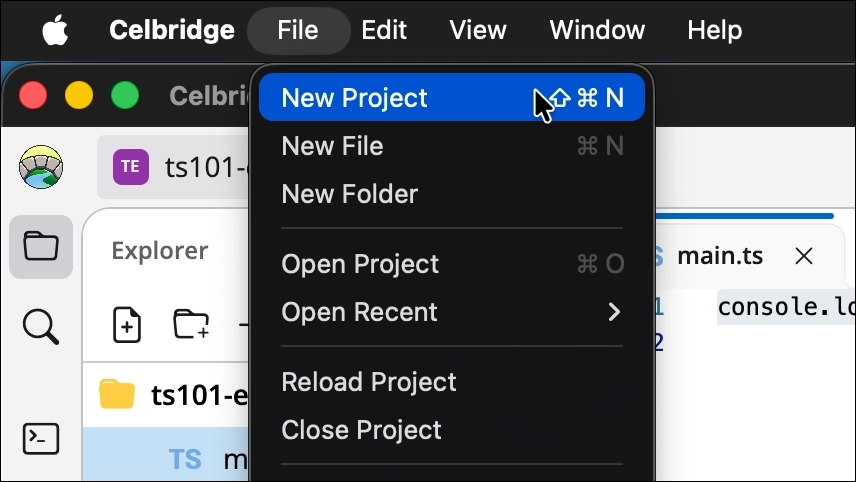
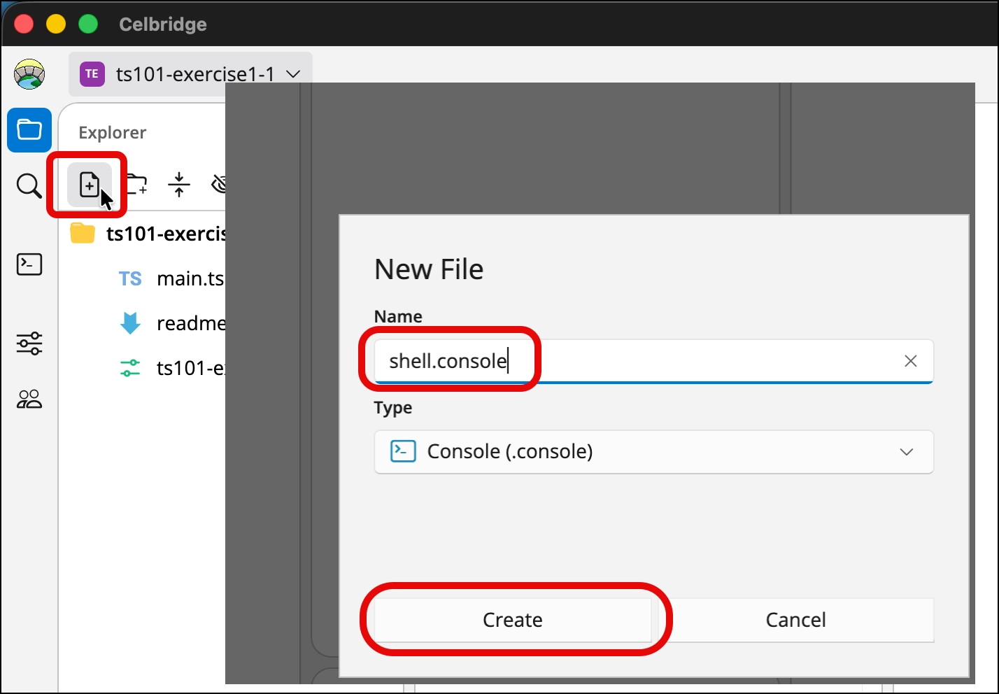
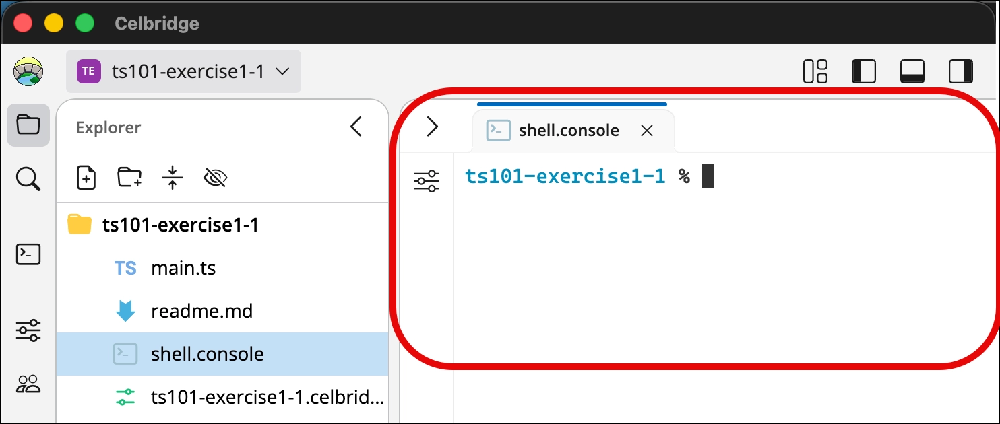
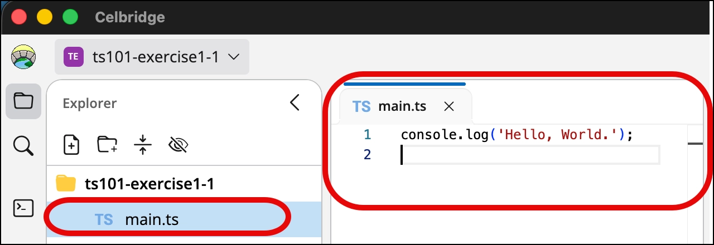
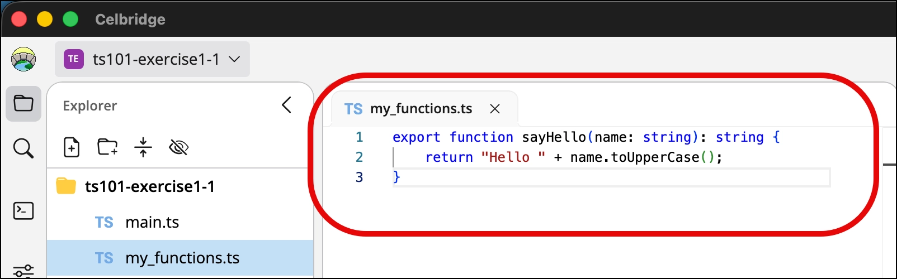
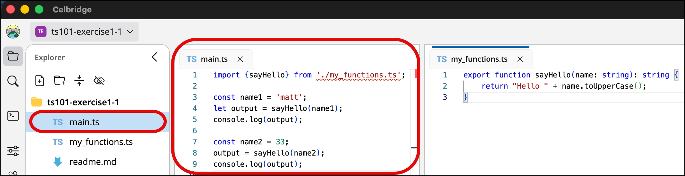

# TypeScript 101 - part 01 - Set up a TS project, run main and typecheck a function call

> This README uses **Node** (v26 or later), e.g. on the college lab PCs. If you have Deno installed,
> [README.md](README.md) is the main version of these exercises, with Deno commands.
>
> See [README_node_TS_workflow.md](README_node_TS_workflow.md) for a summary of the Node commands.

## Exercise 1-1: Install Node

Do the following:

1. install **Node** (version 26 or later) on your system:

https://nodejs.org/

(If you're on a college lab PC, Node is probably already installed - go on to Exercise 1-2 to check.)

NOTE:
- Node version 26 or later can **run** TypeScript files directly
  - https://nodejs.org/learn/typescript/run
- but it does **not check your types** - for that we'll install the TypeScript compiler `tsc` (in Exercise 1-4)

## Exercise 1-2: test your Node setup

Do the following:


1. create a new project
   - e.g. create a new empty Celbridge project



1. create (and open) a Celbridge console document
   <br>
(or open some other CLI terminal on your system)

  - e.g I usually create a simple console document named `shell.console`
    - no settings need to be changed for the default console document






2. test **Node** at the command line (the version should be 26 or later)

```bash
node -v
```

TERMINAL DUMP:
```bash
$ node -v
v26.8.1
```

3. test **npm** at the command line - npm (the Node Package Manager) comes with Node, and we use it to install tools:

```bash
npm -v
```

TERMINAL DUMP:
```bash
$ npm -v
11.19.0
```

## Exercise 1-3: Create hello world TypeScript project

1. create (and open) file `main.ts` containing the following:

```ts
console.log('Hello, World.');
```




2. test your script with **Node**:

```bash
node main.ts
```

TERMINAL DUMP:
```bash
$ node main.ts
Hello, World.
```

## Exercise 1-4: Test type checking with a function

1. create (and open) file `my_functions.ts` containing the following function `sayHello(<string>)`:

```ts
// my_functions.ts
export function sayHello(name: string): string {
    return "Hello " + name.toUpperCase();
}
```



2. Edit `main.ts` to call the function with a string, then a number:

```ts
// main.ts
import {sayHello} from './my_functions.ts';

const name1 = 'matt';
let output = sayHello(name1);
console.log(output);

const name2 = 33;
output = sayHello(name2);
console.log(output);
```



3. run the script with **Node**:

```bash
node main.ts
```

TERMINAL DUMP:
```bash
$ node main.ts
Hello MATT
file:///Users/matt/ts101-part01/my_functions.ts:2
    return "Hello " + name.toUpperCase();
                           ^

TypeError: name.toUpperCase is not a function
    at sayHello (file:///Users/matt/ts101-part01/my_functions.ts:2:28)
    at file:///Users/matt/ts101-part01/main.ts:8:10
    ...

Node.js v26.8.1
```

NOTE:
- Node ran the script, and it **crashed** at run time: the first call worked, but the second passed a number, and numbers don't have a `toUpperCase()` method
- Node just removes the types and runs the code - it never checked them!
- we want to find mistakes like this **before** running the code - that's what the TypeScript type checker `tsc` is for

4. set up the TypeScript type checker

    1. create file `package.json` containing the following - it lists the tools the project needs, and a shortcut to run the type checker:

    ```json
    {
      "name": "ts101-part01",
      "version": "1.0.0",
      "private": true,
      "type": "module",
      "scripts": {
        "start": "node main.ts",
        "check": "tsc --noEmit"
      },
      "devDependencies": {
        "typescript": "^5.9.0"
      }
    }
    ```

    2. create file `tsconfig.json` containing the following - it configures the type checker:

    ```json
    {
      "compilerOptions": {
        "target": "ES2022",
        "module": "ESNext",
        "moduleResolution": "bundler",
        "lib": ["dom", "dom.iterable", "esnext"],
        "strict": true,
        "noEmit": true,
        "allowImportingTsExtensions": true,
        "skipLibCheck": true
      },
      "include": ["*.ts"]
    }
    ```

    3. install TypeScript into a `node_modules/` folder (only needed **once per project**, and needs an internet connection):

    ```bash
    npm install
    ```

5. get **tsc** to check the scripts:

```bash
npm run check
```

TERMINAL DUMP:
```bash
$ npm run check

> ts101-part01@1.0.0 check
> tsc --noEmit

main.ts(8,19): error TS2345: Argument of type 'number' is not assignable to parameter of type 'string'.
```

NOTE:
- the error occurs at line 8 (character 19), since this is when `main.ts` is passing a number (`33` inside `name2` to the function expecting a string)
- `npm run check` runs the `"check"` shortcut from the `"scripts"` section of `package.json`, i.e. `tsc --noEmit`
  - `--noEmit` means only check the types - don't create any JavaScript files


## Exercise 1-5: Comment out bad code and see it work

If we comment out the code calling the function the second time, then it should all work fine:

```ts
import {sayHello} from './my_functions.ts';

const name1 = 'matt';
let output = sayHello(name1);
console.log(output);

// const name2 = 33;
// output = sayHello(name2);
// console.log(output);
```

Check the types, and run the script, again:

```bash
npm run check
```

```bash
node main.ts
```

TERMINAL DUMP:
```bash
$ npm run check

> ts101-part01@1.0.0 check
> tsc --noEmit

$ node main.ts
Hello MATT
```

No errors from the type checker, and the script runs fine!

TIP: `npm start` is a shortcut for `node main.ts` (it runs the `"start"` script in `package.json`)
