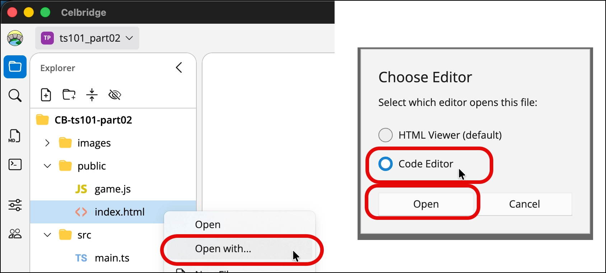
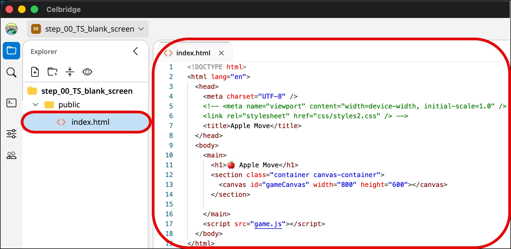
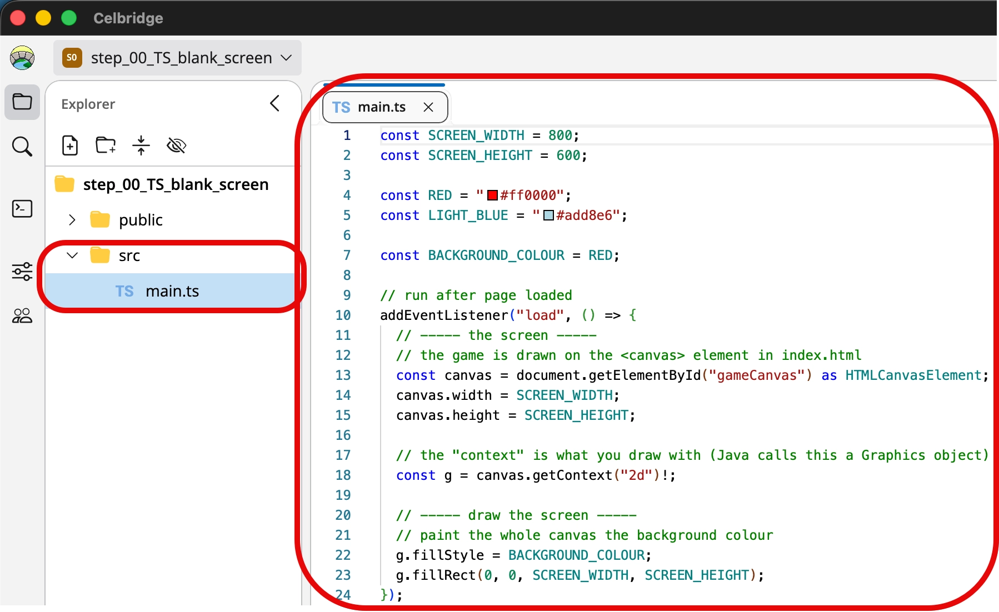
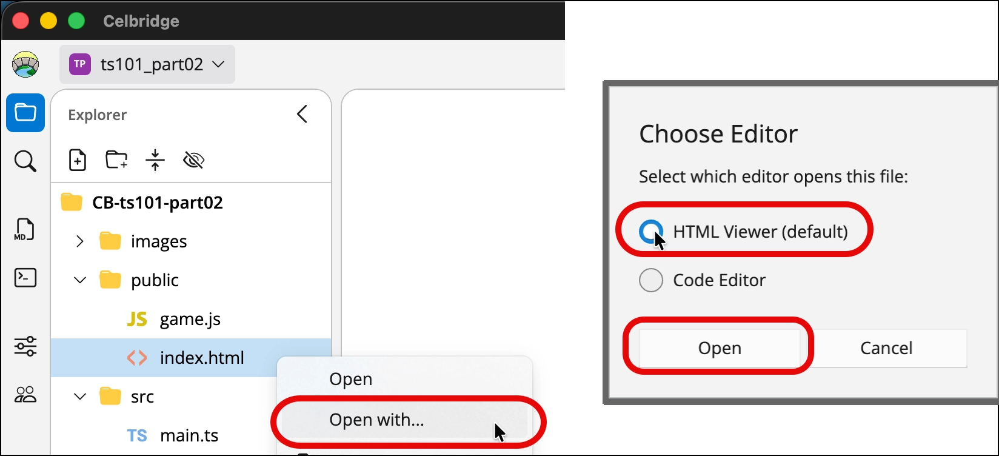
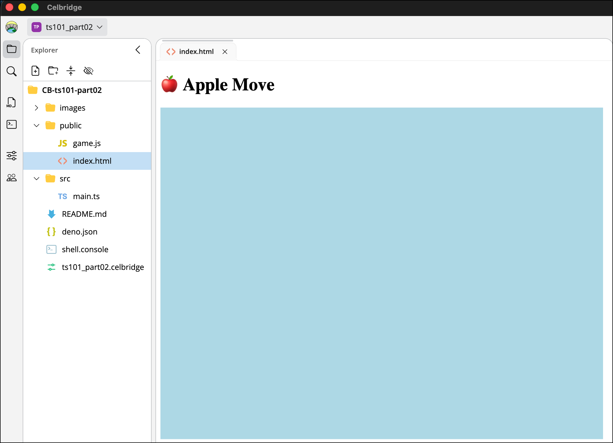
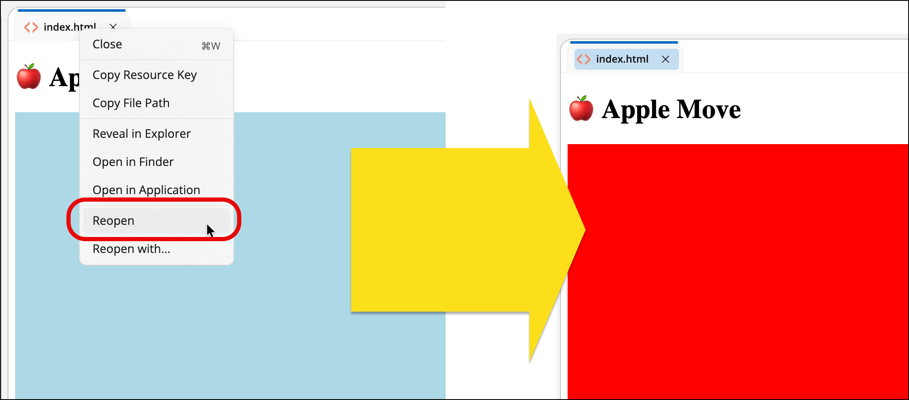

# TypeScript 101 - part 02 - build an HTML/CSS/JS site from TS source

A simple TS-driven website can be as simple as follows:
- TS source code in `/src`
- HTML/CSS/images to populate final site in `/public`
  - a `<script>` element in the HTML code to read transpiled JavaScript
  - e.g. `/src/main.ts` -> `/public/game.js`


## Exercise 2-1: Create HTML page in `/public`

Do the following:

1. start with a new, empty Celbridge project
    - and add a default shell console document (`shell.console`)

1. create folder `/public`, and inside create `index.html`, containing the following:

NOTE: You may need to context menu (right mouse click) to open the document with the Code Editor




```html
<!DOCTYPE html>
<html lang="en">
  <head>
    <meta charset="UTF-8" />
    <title>Apple Move</title>
  </head>
  <body>
    <main>
      <h1>🍎 Apple Move</h1>
      <section class="container canvas-container">
        <canvas id="gameCanvas" width="800" height="600"></canvas>
      </section>

    </main>
    <script src="game.js"></script>
  </body>
</html>
```

NOTE:
- you'll see how our `<script>` element reads `game.js`
- TypeScript sources files are translated into JavaScript `.js` when distributed/published on the web



## Exercise 2-2: Create a simple `main.ts` in  folder `/src`

```ts
const SCREEN_WIDTH = 800;
const SCREEN_HEIGHT = 600;

const RED = "#ff0000";
const LIGHT_BLUE = "#add8e6";

const BACKGROUND_COLOUR = RED;
 
// run after page loaded
addEventListener("load", () => {
  // ----- the screen -----
  // the game is drawn on the <canvas> element in index.html
  const canvas = document.getElementById("gameCanvas") as HTMLCanvasElement;
  canvas.width = SCREEN_WIDTH;
  canvas.height = SCREEN_HEIGHT;

  // the "context" is what you draw with (Java calls this a Graphics object)
  const g = canvas.getContext("2d")!;

  // ----- draw the screen -----
  // paint the whole canvas the background colour
  g.fillStyle = BACKGROUND_COLOUR;
  g.fillRect(0, 0, SCREEN_WIDTH, SCREEN_HEIGHT);
});
```


NOTE:
- this TS script defines some constants for screen size and colors
- then defines an event handler function for the page `load` event
- when the page is loaded, the canvas will be covered with a rectangle filled with a red color

## Exercise 2-3: Create our JS from our TS script


1. get deno to transpile `/src/main.ts` -> `/public/game.js`

At the terminal, run:

```bash
deno bundle --platform browser --watch src/main.ts -o public/game.js
```

TERMINAL DUMP:
```bash
$ deno bundle --platform browser src/main.ts -o public/game.js
⚠️  deno bundle is experimental and subject to changes
Bundled 1 module in 2ms
  public/game.js 406B

CB-ts101-part02 % 
```


## Exercise 2-4: View the HTML file

We won't need to edit the HTML file again, so now we can just view it (rendered as a web page)


So now use the `/public/index.html` context menu (right mouse click) to open the document with the HTML Viewer



You should now see the web page, with text Apple Move, and blue rectangle
- which will be the drawing canvas we can code our TypeScript game to run within ...




## Exercise 2-5: Change the background to red

1. In file `/src/main.ts` edit line 7, so that the `BACKGROUND_COLOUR` constant is set to `RED` not `LIGHT_BLUE`:

    ```ts
    const SCREEN_WIDTH = 800;
    const SCREEN_HEIGHT = 600;
    
    const RED = "#ff0000";
    const LIGHT_BLUE = "#add8e6";
    
    const BACKGROUND_COLOUR = RED;
     
    ...
    ```
1. get deno to transpile the updated `/src/main.ts` -> `/public/game.js`

    At the terminal, run:
    
    ```bash
    deno bundle --platform browser --watch src/main.ts -o public/game.js
    ```
    
    TERMINAL DUMP:
    ```bash
    $ deno bundle --platform browser src/main.ts -o public/game.js
    ⚠️  deno bundle is experimental and subject to changes
    Bundled 1 module in 2ms
      public/game.js 406B
    
    CB-ts101-part02 % 
    ```

1. refresh the HTML page view, to see the new JS code executed:

    Now, for the document tab for `index.html` use the context (right-mouse button) menu, and reload the document
    - you should now see the updated JS code run showing a RED background to our canvas rectangle
    
    


## Exercise 2-6: make life easier with a deno JSON script

It's annoying to have to repeat long CLI commands like:

```bash
deno bundle --platform browser --watch src/main.ts -o public/game.js
```

There is a solution! We can create a file `deno.json` and create shortcuts for such instructions.


1. Create file `deno.json` containing the following:

    ```json
    {
      "tasks": {
        "build": "deno bundle --platform browser src/main.ts -o public/game.js",
        "check": "deno check src/main.ts"
      }
    }
    ```

1. Delete `/public/game.js`

1. Regenerate `/public/game.js` from  `/src/main.ts` with our shortcut

    - type `deno run build` at the command line

   TERMINAL DUMP:
    ```bash
    $ deno run build                                              
    Task build deno bundle --platform browser src/main.ts -o public/game.js
    ⚠️  deno bundle is experimental and subject to changes
    Bundled 1 module in 1ms
    public/game.js 392B
    ```

Our JSON script has created 2 shortcuts for us:

- `deno run build` 
  - this runs `deno bundle --platform browser src/main.ts -o public/game.js`
  - which transpiles  `/src/main.ts` into `/public/game.js`

- `deno run check`
    - this runs `deno check src/main.ts`
    - which runs a static code check for file `src/main.ts``

