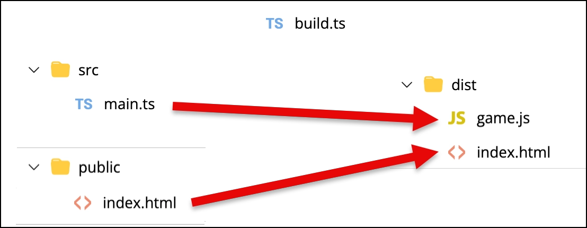
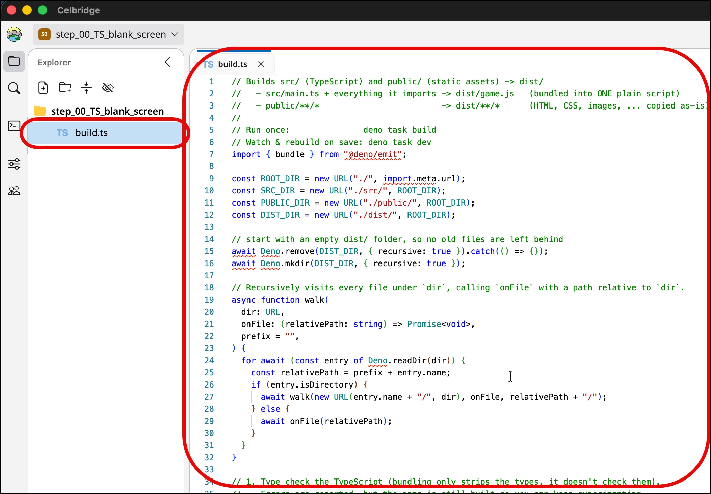
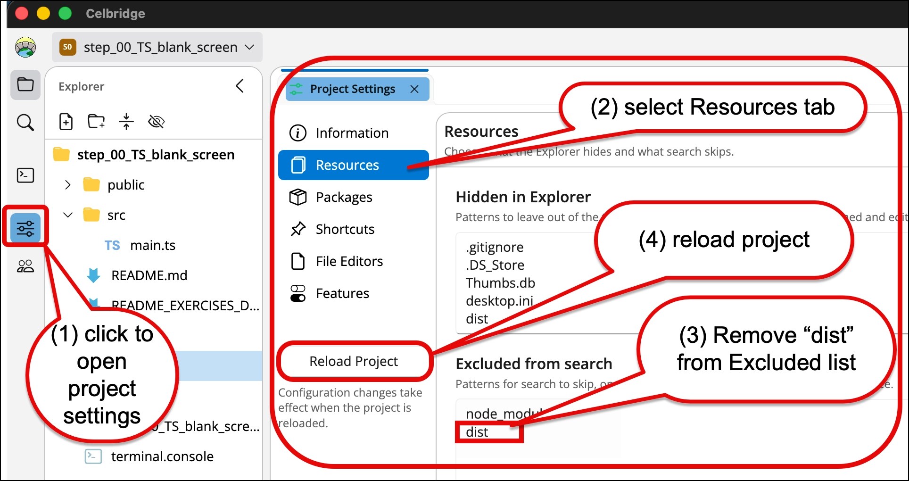
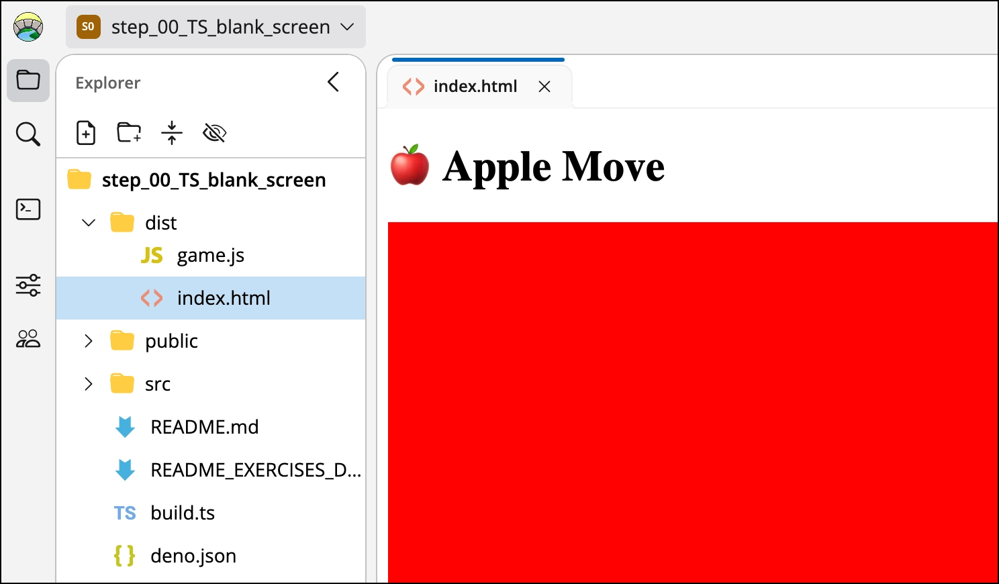

# TypeScript 101 - part 03 - build tooling, to combine all TS scripts into a single JS

Rather than working directly in `/public`, and rather than individually transpiling each TS file into a JS file, a typical project setup for a TS-driven website game is as follows:
- final site output in `/dist`
- TS source code in `/src`
- HTML/CSS/images to populate final site in `/public`
- a TS build script in `build.ts`
   - which builds ALL source files ingto a single `/dist/game.js` script

So we can upload/ZIP and share the contents of the `/dist` folder
- "dist" is short for "distribution" ...





## Exercise 3-1: Make a copy of the previous project

1. copy the previous project

delete `/public/game.js` (if it exists)

Now, the contents of `public` are files that will be copied, unchanged, into the `dist` folder when we build the project

We don't want to keep 'stale' JS files around
- we'll build a fresh `/dist/game.js` whenever we need to ...

## Exercise 3-2: Create a general-purpose TS build script `build.ts`

1. create a TS build script `build.ts`

(don't worry too much about the contents of this tool - just have it in your project to make your life much easier!)

When we have edited TypeScript files, we want to then transpile (translate) them into JavaScript, adn combine them all into a single file `/game.js`

This `build.ts` wil do this for us
- since we have deno, we can write useful scripts in TypeScript, since deno can run TypeScript files directly

This script will transpile all the TS script in `/src` into a single JS file as `/dist/game.js`.
- to run once we'd run at the terminal `deno task build`
- to ask deno to watch TS files for changes, and then automatically rebuild `/dist/game.js` we'd run at the terminal `deno task dev`

```ts
import { bundle } from "@deno/emit";

const ROOT_DIR = new URL("./", import.meta.url);
const SRC_DIR = new URL("./src/", ROOT_DIR);
const PUBLIC_DIR = new URL("./public/", ROOT_DIR);
const DIST_DIR = new URL("./dist/", ROOT_DIR);

// start with an empty dist/ folder, so no old files are left behind
await Deno.remove(DIST_DIR, { recursive: true }).catch(() => {});
await Deno.mkdir(DIST_DIR, { recursive: true });

// Recursively visits every file under `dir`, calling `onFile` with a path relative to `dir`.
async function walk(
  dir: URL,
  onFile: (relativePath: string) => Promise<void>,
  prefix = "",
) {
  for await (const entry of Deno.readDir(dir)) {
    const relativePath = prefix + entry.name;
    if (entry.isDirectory) {
      await walk(new URL(entry.name + "/", dir), onFile, relativePath + "/");
    } else {
      await onFile(relativePath);
    }
  }
}

// 1. Type check the TypeScript (bundling only strips the types, it doesn't check them).
//    Errors are reported, but the game is still built so you can keep experimenting.
const check = await new Deno.Command(Deno.execPath(), {
  args: ["check", "src/main.ts"],
  cwd: ROOT_DIR,
  stdout: "inherit",
  stderr: "inherit",
}).output();
if (!check.success) {
  console.log("TypeScript found errors (see above) - the game was still built, but may not work");
}

// 2. Bundle src/main.ts and every file it imports into dist/game.js.
const result = await bundle(new URL("main.ts", SRC_DIR), { type: "classic" });
await Deno.writeTextFile(new URL("game.js", DIST_DIR), result.code);
console.log("Built dist/game.js from src/main.ts (and the files it imports)");

// 3. Copy every file under public/ (HTML, CSS, README_images, ...) as-is.
await walk(PUBLIC_DIR, async (relativePath) => {
  const fileSrc = new URL(relativePath, PUBLIC_DIR);
  const fileOut = new URL(relativePath, DIST_DIR);

  await Deno.mkdir(new URL(".", fileOut), { recursive: true });
  await Deno.copyFile(fileSrc, fileOut);
  console.log(`Copied dist/${relativePath} from public/${relativePath}`);
});
```




## Exercise 3-3: Declare shortcuts and dependencies in `deno.json`

Our build script needs a shortcut, and some dependent libraries, which can declare in our `deno.json` file.

1. So replace the contents of `deno.json` with the following:

```json
{
  "tasks": {
    "build": "deno run --allow-read --allow-write --allow-net --allow-env --allow-run build.ts",
    "dev": "deno run --watch=src,public --allow-read --allow-write --allow-net --allow-env --allow-run build.ts",
    "check": "deno check src/main.ts"
  },
  "imports": {
    "@deno/emit": "jsr:@deno/emit@^0.46.0"
  },
  "compilerOptions": {
    "lib": ["dom", "dom.iterable", "esnext"]
  }
}
```

We have now declared 3 shortcuts:
- `deno run build`
  - this will take all TS files in `/src` and combine them into a single JS file `/dist/game.js`
- `deno run dev`
  - this automates the previous action - so deno runs a server to WATCH for TS files changes in `/src`, and when a file is updated, it automatically re-builds `/dist/game.js`
- `deno run check`
  - this allows us to run a static type check on our TS files, to help avoid run-time errors ...


## Exercise 3-4: Build the `dist` folder from source

Run the build by typing in the console line:

```bash
deno run build     
```

TERMINAL DUMP:
```bash
$  deno run build  
Task build deno run --allow-read --allow-write --allow-net --allow-env --allow-run build.ts
Built dist/game.js from src/main.ts (and the files it imports)
Copied dist/index.html from public/index.html
```

You now have a `dist` folder containing your HTML game!
- but you may not be able to see it yet, due to a default setting in Celbridge 
- we'll fix this in the next step


![Celbridge hidden dist folder(README_images/5_hidden_dist_folder.webp)

## Exercise 3-4: Configuring Celbridge to show the `dist` folder

Usually we would `.gitignore` the `dist` folder, and so this folder is hidden by default in teh Celbridge workbench.

So we need to tweak a project setting, so that we can hide/show this folder, for when we want to preview `/dist/index.html`.

1. Open the Celbridge settings
   - click the setting slider button in the utilities panel on the left
   - (second from bottom, above the community button)

1. The **Project Settings** document should open as a tabbed document

1. Select the **Resources** tab

1. Delete `dist` from the list at the bottom fo the page
   - the list of **Excluded from search** items

1. Click the **Reload Project** button
   - after updating project settings, you need to reload the project for the changes to take effect




## Exercise 3-4: View the `dist` folder

You should now be able to see the `dist` folder




