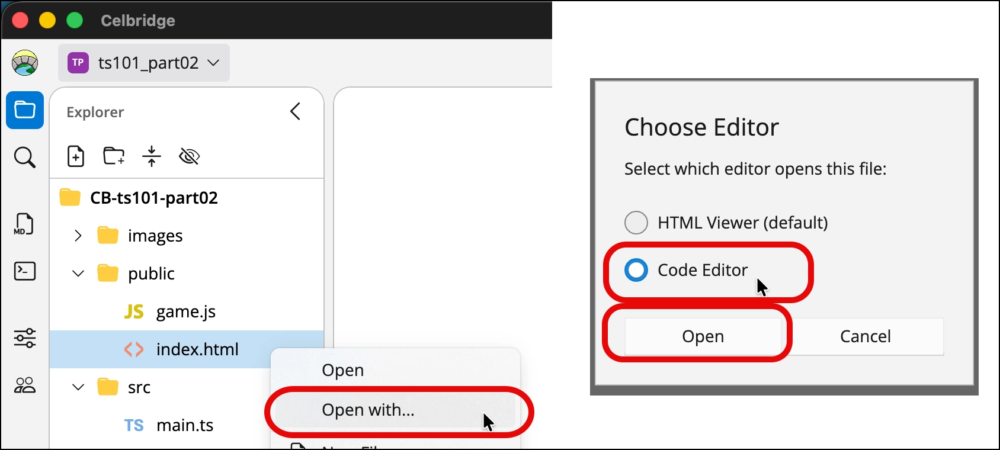
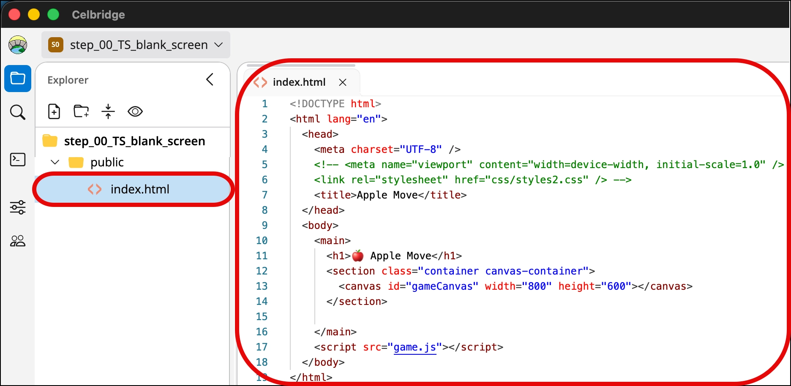
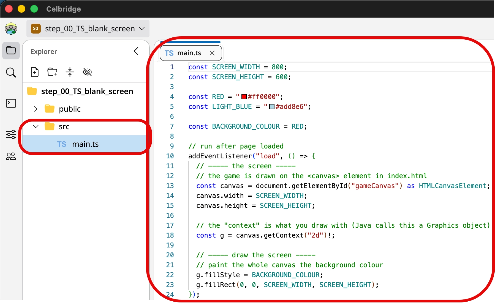
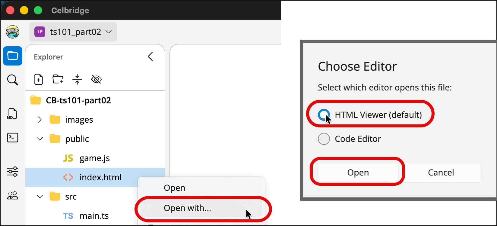
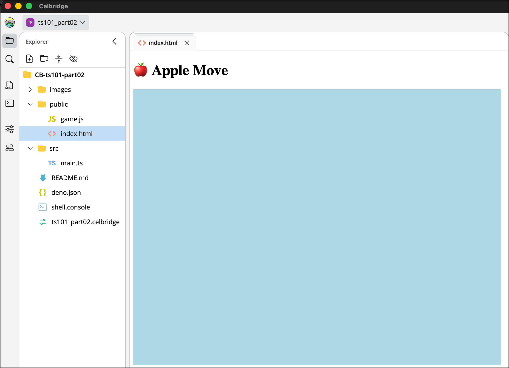
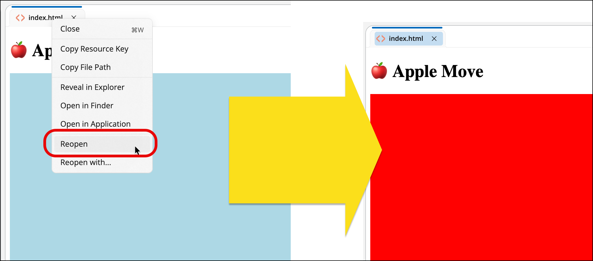

# TypeScript 101 - part 03 - build an HTML/CSS/JS site from TS source

A simple TS-driven website can be as simple as follows:
- TS source code in `/src`
- HTML/CSS/images to populate final site in `/public`
  - a `<script>` element in the HTML code to read transpiled JavaScript
- the final site is built into `/dist`
  - `/src/main.ts` -> `/dist/app.js` (TypeScript transpiled into JavaScript)
  - `/public/index.html` -> `/dist/index.html` (copied as-is)


> This README uses **Deno**.
>
> See [README_deno_TS_workflow.md](README_deno_TS_workflow.md) for all the Deno build commands.

## Running the finished project

Open the project in Celbridge. The console at the bottom (`terminal.console`) starts by itself, and runs `deno task dev`:

1. **builds** `src/` (TypeScript) and `public/` (HTML, CSS, images) into `dist/`
2. **tests** everything in `tests/`, and writes a readable report to `test_output/index.html`
3. **watches** - every time you save a file in `src/`, `public/` or `tests/`, it does it all again

`dist/index.html` opens beside the console. After a rebuild, press its **refresh** button to see your changes.

(Part 4 looks at this build tooling in more detail.)

## Exercise 3-1: Start from a copy of the part 2 project

Do the following:

1. copy the part 2 (Hello, World) project
    - it has all the build tooling we need: `build.ts`, `deno.json`, `terminal.console`, `tools/` and `tests/`

1. delete these 3 files - we're going to write our own:
    - `src/main.ts`
    - `public/index.html`
    - `public/styles.css`

1. open the copied project in Celbridge
    - the console starts `deno task dev`, which waits for you to save a file in `src/`, `public/` or `tests/`
    - (it will report errors until you have created `src/main.ts` - that's fine)

## Exercise 3-2: Create HTML page in `/public`

1. create folder `/public`, and inside create `index.html`, containing the following:

NOTE: You may need to context menu (right mouse click) to open the document with the Code Editor




```html
<!DOCTYPE html>
<html lang="en">
  <head>
    <meta charset="UTF-8" />
    <title>Apple Move</title>
  </head>
  <body>
    <main>
      <h1>🍎 Apple Move</h1>
      <section class="container canvas-container">
        <canvas id="gameCanvas" width="800" height="600"></canvas>
      </section>

    </main>
    <script src="app.js"></script>
  </body>
</html>
```

NOTE:
- you'll see how our `<script>` element reads `app.js`
- TypeScript sources files are translated into JavaScript `.js` when distributed/published on the web



## Exercise 3-3: Create a simple `main.ts` in  folder `/src`

```ts
const SCREEN_WIDTH = 800;
const SCREEN_HEIGHT = 600;

const RED = "#ff0000";
const LIGHT_BLUE = "#add8e6";

const BACKGROUND_COLOUR = LIGHT_BLUE;
 
// run after page loaded
addEventListener("load", () => {
  // ----- the screen -----
  // the game is drawn on the <canvas> element in index.html
  const canvas = document.getElementById("gameCanvas") as HTMLCanvasElement;
  canvas.width = SCREEN_WIDTH;
  canvas.height = SCREEN_HEIGHT;

  // the "context" is what you draw with (Java calls this a Graphics object)
  const g = canvas.getContext("2d")!;

  // ----- draw the screen -----
  // paint the whole canvas the background colour
  g.fillStyle = BACKGROUND_COLOUR;
  g.fillRect(0, 0, SCREEN_WIDTH, SCREEN_HEIGHT);
});
```


NOTE:
- this TS script defines some constants for screen size and colors
- then defines an event handler function for the page `load` event
- when the page is loaded, the canvas will be covered with a rectangle filled with the background colour

## Exercise 3-4: Watch the console build `/dist`

As soon as you save `src/main.ts`, the console rebuilds the project:

TERMINAL DUMP:
```bash
=== Build started at 10:37:14 AM ===
Built dist/app.js from src/main.ts (and the files it imports)
Copied 1 file(s) from public/ to dist/
dist/ is up to date (0.7s) - press refresh on the dist/index.html preview

Tests: 0 failed, 0 passed, 0 skipped, 0 type errors, 1 lint warnings  ->  test_output/index.html

Watching src/, public/ and tests/ - save a file to rebuild and retest (Ctrl+C to stop)
```

NOTE:
- `src/main.ts` has been transpiled (TypeScript -> JavaScript) into `dist/app.js`
- `public/index.html` has been copied into `dist/index.html`
- the 1 lint warning is because `RED` is never used - harmless here (the report in `test_output/index.html` shows the details)

## Exercise 3-5: View the web page

Now open `/dist/index.html` with the HTML Viewer
- the context menu (right mouse click) lets you choose the HTML Viewer
- (in the finished project, it opens beside the console by itself)



You should now see the web page, with text Apple Move, and blue rectangle
- which will be the drawing canvas we can code our TypeScript game to run within ...




## Exercise 3-6: Change the background to red

1. In file `/src/main.ts` edit line 7, so that the `BACKGROUND_COLOUR` constant is set to `RED` not `LIGHT_BLUE`:

    ```ts
    const SCREEN_WIDTH = 800;
    const SCREEN_HEIGHT = 600;
    
    const RED = "#ff0000";
    const LIGHT_BLUE = "#add8e6";
    
    const BACKGROUND_COLOUR = RED;
     
    ...
    ```

1. save the file - the console rebuilds `/dist` for you

1. refresh the HTML page view, to see the new JS code executed:

    - press the **refresh** button on the `dist/index.html` preview
    - you should now see the updated JS code run showing a RED background to our canvas rectangle
    
    

NOTE:
- edit files in `/src` and `/public` - never in `/dist`, since every build replaces what's in there
- no web server is needed: `/dist` is a plain web page, so you can also open `dist/index.html` in any web browser
