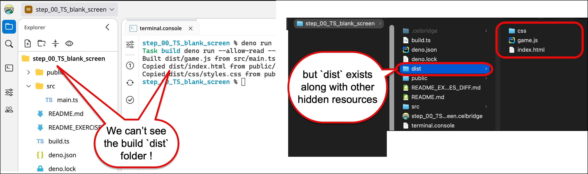

# TypeScript 101 - part 03 - build tooling, to combine all TS scripts into a single JS

Rather than working directly in `/public`, and rather than individually transpiling each TS file into a JS file, a typical project setup for a TS-driven website game is as follows:
- final site output in `/dist`
- TS source code in `/src`
- HTML/CSS/images to populate final site in `/public`
- a TS build script in `build.ts`
   - which builds ALL source files ingto a single `/dist/game.js` script

So we can upload/ZIP and share the contents of the `/dist` folder
- "dist" is short for "distribution" ...


> This README uses **Node** (v26 or later), e.g. on the college lab PCs. If you have Deno installed,
> [README.md](README.md) is the main version of these exercises, with Deno commands.
>
> See [README_node_TS_workflow.md](README_node_TS_workflow.md) for all the Node build and serve commands.

## Exercise 3-1: Make a copy of the previous project

1. copy the previous project

delete `/public/game.js` (if it exists)

Now, the contents of `public` are files that will be copied, unchanged, into the `dist` folder when we build the project

We don't want to keep 'stale' JS files around
- we'll build a fresh `/dist/game.js` whenever we need to ...

## Exercise 3-2: Create a general-purpose TS build script `build.ts`

1. create a TS build script `build.ts`

(don't worry too much about the contents of this tool - just have it in your project to make your life much easier!)

When we have edited TypeScript files, we want to then transpile (translate) them into JavaScript, and combine them all into a single file `/game.js`

This `build.ts` will do this for us
- Node (v26 or later) can run TypeScript files directly, so we can write useful scripts in TypeScript
- the same `build.ts` works with both Deno and Node - it uses the **esbuild** tool to do the bundling

This script will transpile all the TS script in `/src` into a single JS file as `/dist/game.js`.
- to run once we'd run at the terminal `npm run build`
- to watch TS files for changes, and then automatically rebuild `/dist/game.js` we'd run at the terminal `npm run dev`

```ts
// Builds src/ (TypeScript) and public/ (static assets) -> dist/
//   - src/main.ts + everything it imports -> dist/game.js   (bundled into ONE plain script)
//   - public/**/*                         -> dist/**/*      (HTML, CSS, images, ... copied as-is)
//
// Works with both Node and Deno:
//   Run once:                npm run build   OR   deno task build
//   Watch & rebuild on save: npm run dev     OR   deno task dev
import { spawnSync } from "node:child_process";
import { copyFileSync, mkdirSync, readdirSync, rmSync } from "node:fs";
import { createRequire } from "node:module";
import process from "node:process";
import * as esbuild from "esbuild";

const isDeno = "Deno" in globalThis;

// start with an empty dist/ folder, so no old files are left behind
rmSync("dist", { recursive: true, force: true });
mkdirSync("dist", { recursive: true });

// 1. Type check the TypeScript (bundling only strips the types, it doesn't check them).
//    Errors are reported, but the game is still built so you can keep experimenting.
//    Deno has a type checker built in; Node uses the TypeScript compiler from node_modules.
const checkArgs = isDeno
  ? ["check", "src/main.ts"]
  : [createRequire(import.meta.url).resolve("typescript/bin/tsc"), "--noEmit"];
const check = spawnSync(process.execPath, checkArgs, { stdio: "inherit" });
if (check.status !== 0) {
  console.log("TypeScript found errors (see above) - the game was still built, but may not work");
}

// 2. Bundle src/main.ts and every file it imports into dist/game.js.
await esbuild.build({
  entryPoints: ["src/main.ts"],
  bundle: true,
  format: "iife", // a plain <script>, not a module
  outfile: "dist/game.js",
  logLevel: "warning",
});
await esbuild.stop(); // Deno waits for esbuild's helper process, so shut it down
console.log("Built dist/game.js from src/main.ts (and the files it imports)");

// 3. Copy every file under public/ (HTML, CSS, images, ...) as-is.
function copyFolder(from: string, to: string) {
  mkdirSync(to, { recursive: true });
  for (const entry of readdirSync(from, { withFileTypes: true })) {
    const fileSrc = `${from}/${entry.name}`;
    const fileOut = `${to}/${entry.name}`;
    if (entry.isDirectory()) {
      copyFolder(fileSrc, fileOut);
    } else if (entry.name !== ".DS_Store" && !entry.name.endsWith(".cel")) {
      copyFileSync(fileSrc, fileOut);
      console.log(`Copied ${fileOut} from ${fileSrc}`);
    }
  }
}
copyFolder("public", "dist");
```


## Exercise 3-3: Declare shortcuts and dependencies in `package.json`

Our build script needs some shortcuts, and some dependent tools, which we declare in a `package.json` file.
We also need a `tsconfig.json` file, to configure the TypeScript type checker.

1. Create (or replace the contents of) `package.json` with the following:

```json
{
  "name": "ts101-part03",
  "version": "1.0.0",
  "private": true,
  "type": "module",
  "scripts": {
    "build": "node build.ts",
    "dev": "node --watch-path=src --watch-path=public build.ts",
    "check": "tsc --noEmit",
    "serve": "esbuild --servedir=dist --serve=127.0.0.1:8000"
  },
  "devDependencies": {
    "esbuild": "^0.25.0",
    "typescript": "^5.9.0"
  }
}
```

2. Create file `tsconfig.json` with the following:

```json
{
  "compilerOptions": {
    "target": "ES2022",
    "module": "ESNext",
    "moduleResolution": "bundler",
    "lib": ["dom", "dom.iterable", "esnext"],
    "strict": true,
    "noEmit": true,
    "allowImportingTsExtensions": true,
    "skipLibCheck": true
  },
  "include": ["src"]
}
```

3. Install the tools listed in `package.json` (esbuild and TypeScript) into a `node_modules/` folder:

```bash
npm install
```

You only need to do this **once per project** (it needs an internet connection).

We have now declared 4 shortcuts (in the `"scripts"` section of `package.json`):
- `npm run build`
  - this will take all TS files in `/src` and combine them into a single JS file `/dist/game.js`
- `npm run dev`
  - this automates the previous action - so Node WATCHES for file changes in `/src` and `/public`, and when a file is updated, it automatically re-builds `/dist`
- `npm run check`
  - this allows us to run a static type check on our TS files, to help avoid run-time errors ...
- `npm run serve`
  - this runs a local web server, so you can view `/dist` at http://127.0.0.1:8000/ (press Ctrl+C to stop it)

## Exercise 3-4: Build the `dist` folder from source

Run the build by typing in the console line:

```bash
npm run build
```

TERMINAL DUMP:
```bash
$ npm run build

> ts101-part03@1.0.0 build
> node build.ts

Built dist/game.js from src/main.ts (and the files it imports)
Copied dist/index.html from public/index.html
```

You now have a `dist` folder containing your HTML game!
- but you may not be able to see it yet, due to a default setting in Celbridge
- we'll fix this in the next step



## Exercise 3-5: Configuring Celbridge to show the `dist` folder

Usually we would `.gitignore` the `dist` folder, and so this folder is hidden by default in teh Celbridge workbench.

So we need to tweak a project setting, so that we can hide/show this folder, for when we want to preview `/dist/index.html`.

1. Open the Celbridge settings
   - click the setting slider button in the utilities panel on the left
   - (second from bottom, above the community button)

1. The **Project Settings** document should open as a tabbed document

1. Select the **Resources** tab

1. Delete `dist` from the list at the bottom fo the page
   - the list of **Excluded from search** items

1. Click the **Reload Project** button
   - after updating project settings, you need to reload the project for the changes to take effect


## Exercise 3-6: View the `dist` folder

You should now be able to see the `dist` folder


