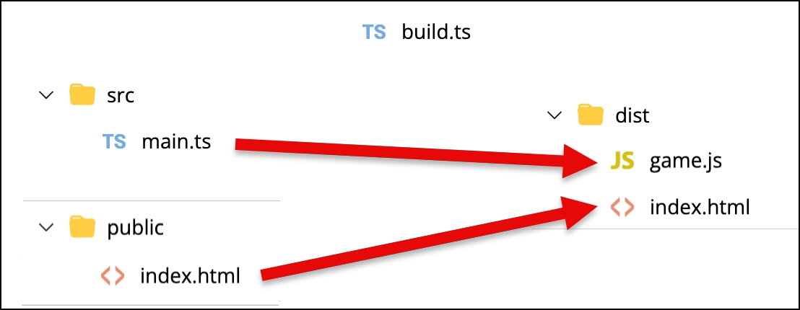
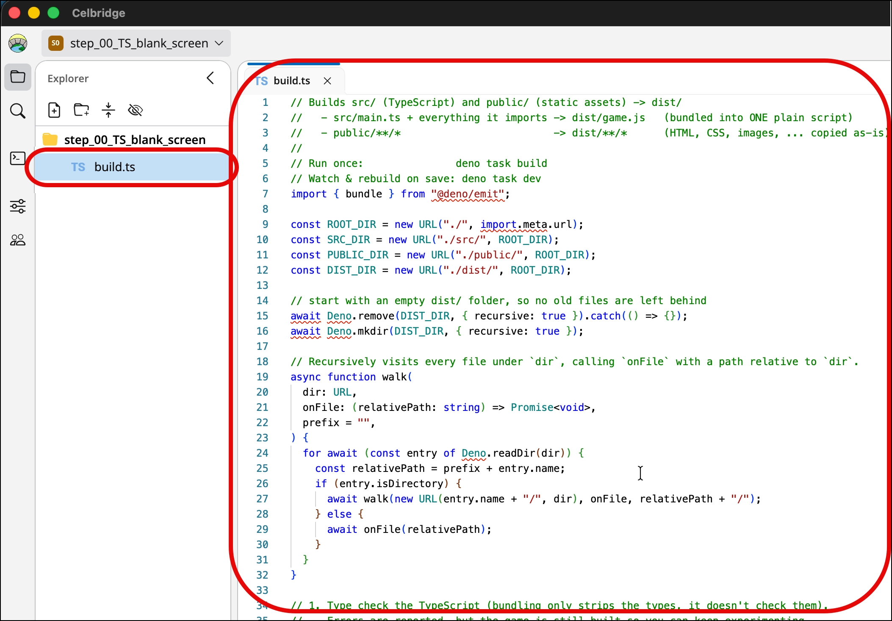
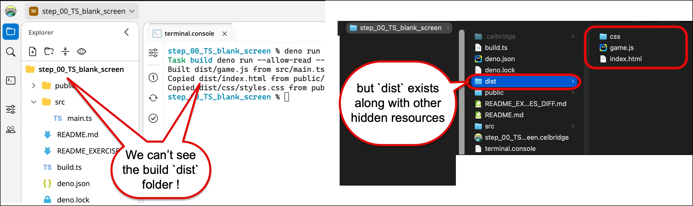
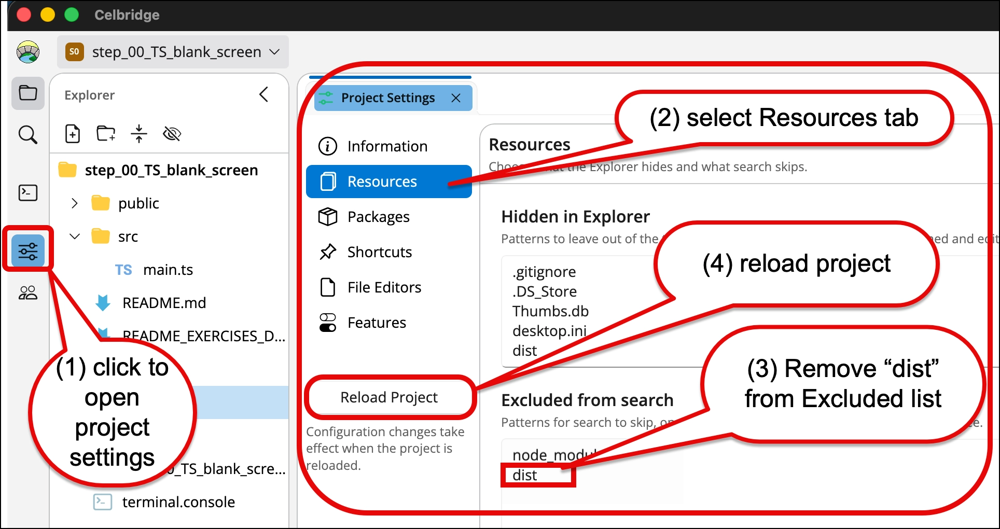
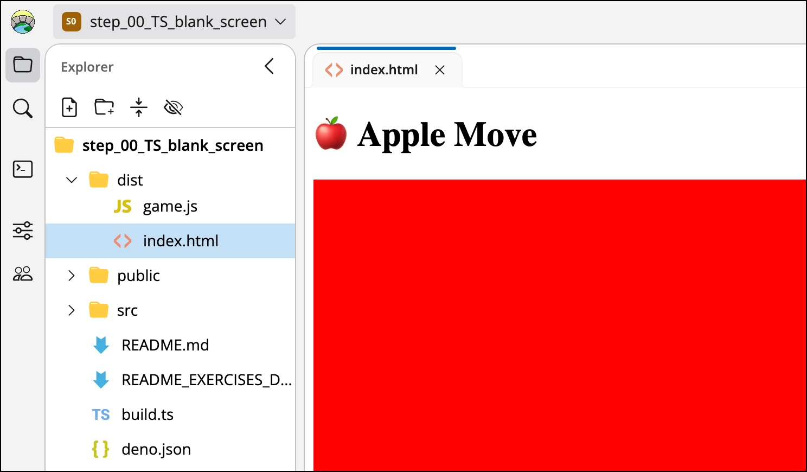

# TypeScript 101 - part 04 - build tooling, to combine all TS scripts into a single JS

Rather than working directly in `/public`, and rather than individually transpiling each TS file into a JS file, a typical project setup for a TS-driven website game is as follows:
- final site output in `/dist`
- TS source code in `/src`
- HTML/CSS/images to populate final site in `/public`
- tests in `/tests`
- a TS build script in `build.ts`
   - which builds ALL source files into a single `/dist/app.js` script

So we can upload/ZIP and share the contents of the `/dist` folder
- "dist" is short for "distribution" ...

In parts 2 and 3 we used the build tooling without looking inside it. In this part we'll look at what each piece does.





> This README uses **Deno**.
>
> See [README_deno_TS_workflow.md](README_deno_TS_workflow.md) for all the Deno build commands.

## Exercise 4-1: Make a copy of the previous project

1. copy the previous project

Now, the contents of `public` are files that will be copied, unchanged, into the `dist` folder when we build the project
- and `dist` is rebuilt from `src` and `public` every time - so we never edit anything in `dist` ourselves

## Exercise 4-2: The build script `build.ts`

1. open `build.ts`

(don't worry too much about the contents of this tool - you never need to edit it, it's just there to make your life much easier!)

When we have edited TypeScript files, we want to then transpile (translate) them into JavaScript, and combine them all into a single file `/dist/app.js`

This `build.ts` does this for us
- since we have Deno, we can write useful scripts in TypeScript, since Deno can run TypeScript files directly
- it uses Deno's built-in bundler, `deno bundle` - no other tools need to be installed

Each time it runs, `build.ts`:
1. **type checks** `src/` and `tests/`, and lists any type errors
    - errors are reported, but the page is still built, so you can keep experimenting
1. **bundles** `src/main.ts`, and every file it imports, into ONE plain JavaScript file `dist/app.js`
1. **copies** everything in `public/` (HTML, CSS, images, ...) into `dist/`, as-is
1. **removes** anything in `dist/` that no longer comes from `public/` (e.g. a deleted image)
1. **tests** - runs every test in `tests/`, and writes a readable report to `test_output/index.html`

It uses `tools/test_report.ts` for the type checking and testing - you never need to edit that either.



## Exercise 4-3: The shortcuts in `deno.json`

1. open `deno.json`

```json
{
  "tasks": {
    "dev": "deno run --watch=src/,public/,tests/ --allow-read --allow-write --allow-run --allow-env build.ts --watching",
    "build": "deno run --allow-read --allow-write --allow-run --allow-env build.ts",
    "test": "deno run --allow-read --allow-write --allow-run --allow-env tools/test_report.ts",
    "check": "deno check --doc src/ tests/",
    "lint": "deno lint src/ tests/"
  },
  "imports": {
    "@std/assert": "jsr:@std/assert@^1"
  },
  "compilerOptions": {
    "lib": ["dom", "dom.iterable", "esnext", "deno.ns"],
    "noImplicitOverride": true
  },
  ...
}
```

We have 5 shortcuts:
- `deno task dev`
  - builds everything, then WATCHES for file changes in `/src`, `/public` and `/tests` - when a file is saved, it automatically re-builds `/dist` and re-runs the tests
  - press Ctrl+C to stop it
- `deno task build`
  - builds `/dist` (and runs the tests) once
- `deno task test`
  - only runs the tests
- `deno task check`
  - only runs a static type check on our TS files, to help avoid run-time errors ...
- `deno task lint`
  - looks for likely mistakes and bad habits (like a constant that's never used)

And some settings:
- `imports` tells Deno where to download the testing library `@std/assert` from (the JSR package library) - it's downloaded automatically, the first time the tests run
- `compilerOptions` tells the type checker our code runs in a web page (so it knows about `document`, `HTMLCanvasElement`, ...), and that `build.ts` runs in Deno
- the `--allow-...` flags are Deno's permissions: by default a Deno script can't touch your files or run other programs, so each task grants exactly what it needs

## Exercise 4-4: The console `terminal.console`

1. open `terminal.console` with the Code Editor

```toml
[session]
type = "shell"

[session.shell]
script = "deno task dev"

[[session.shortcut]]
label = "build, test, and watch for changes (press Ctrl+C first if it is already running)"
icon = "bs-arrow-repeat"
text = "deno task dev"
...
```

- `script` is typed into the console as soon as it opens - so `deno task dev` starts by itself
- each `[[session.shortcut]]` is a button on the console - one each for `dev`, `build`, `test` and `lint`
  - to use a button while `deno task dev` is running, press **Ctrl+C** first to stop it

TERMINAL DUMP:
```bash
$ deno task dev
Task dev deno run --watch=src/,public/,tests/ --allow-read --allow-write --allow-run --allow-env build.ts --watching
Watcher Process started.

=== Build started at 10:37:15 AM ===
Built dist/app.js from src/main.ts (and the files it imports)
Copied 1 file(s) from public/ to dist/
dist/ is up to date (0.4s) - press refresh on the dist/index.html preview

Tests: 0 failed, 0 passed, 0 skipped, 0 type errors, 1 lint warnings  ->  test_output/index.html

Watching src/, public/ and tests/ - save a file to rebuild and retest (Ctrl+C to stop)
Watcher Process finished. Restarting on file change...
```

## Exercise 4-5: The test report `test_output/index.html`

1. click the clipboard button in the side panel, to open `test_output/index.html`

This is a readable report of the last build:
- how many tests passed and failed (and why they failed)
- any type errors
- any lint warnings

`src/main.ts` only draws on the page, so there's nothing in it to test yet - `tests/` just has a `README.md` in it, for now.
In part 5, the colours go in a file of their own (with no DOM in it), so they can be tested in `/tests`, away from the browser.

## Exercise 4-6: Configuring Celbridge to show the `dist` folder

Usually we would `.gitignore` the `dist` folder (and this project does), and so in a new Celbridge project this folder is hidden by default.

If you can't see the `dist` folder in your project, we need to tweak a project setting:



1. Open the Celbridge settings
   - click the setting slider button in the utilities panel on the left
   - (second from bottom, above the community button)

1. The **Project Settings** document should open as a tabbed document

1. Select the **Resources** tab

1. Delete `dist` from the list at the bottom of the page
   - the list of **Excluded from search** items

1. Click the **Reload Project** button
   - after updating project settings, you need to reload the project for the changes to take effect




## Exercise 4-7: View the `dist` folder

You should now be able to see the `dist` folder



