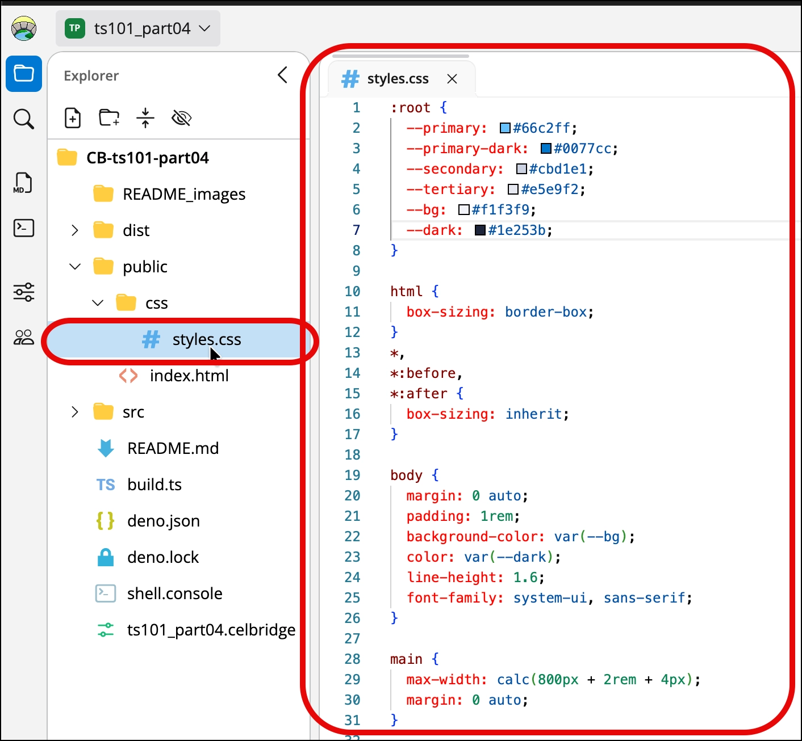
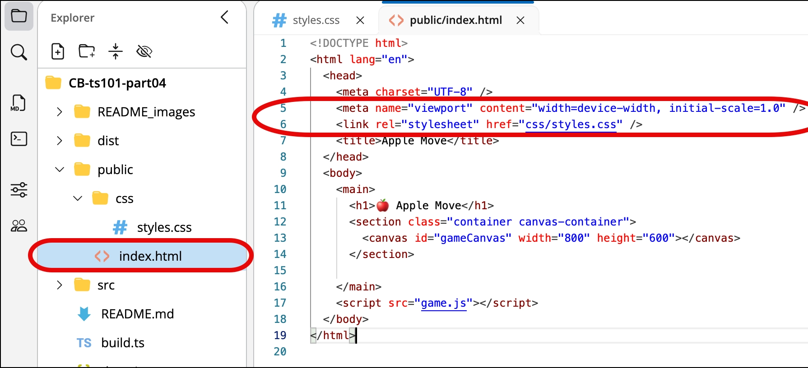
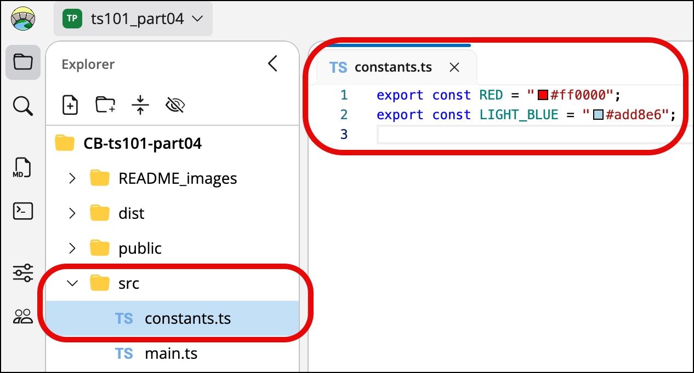
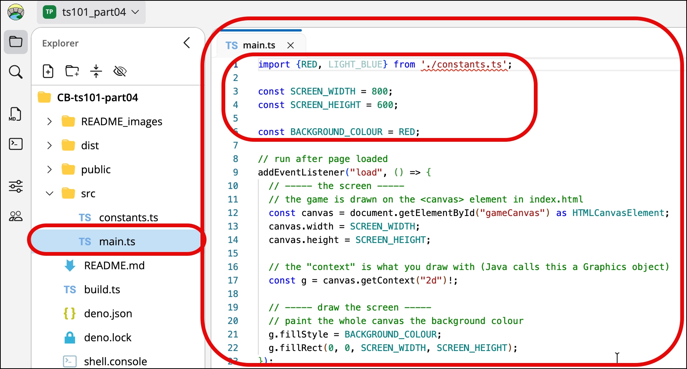
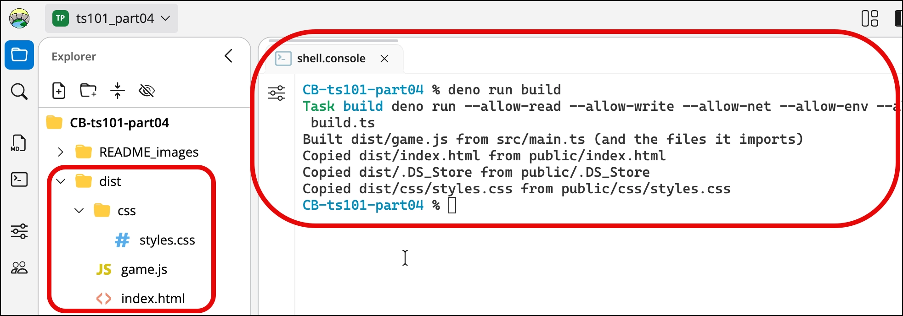
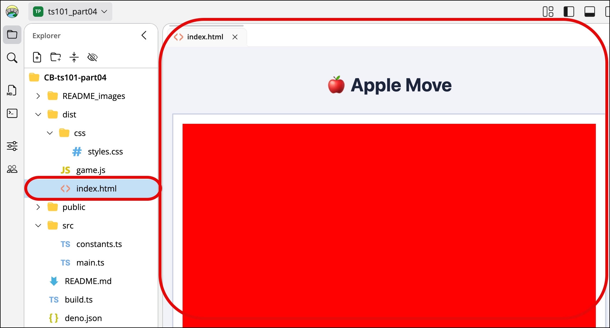
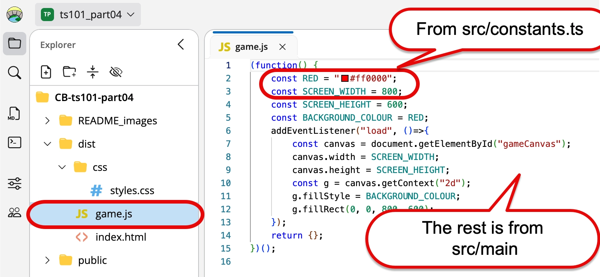

# TypeScript 101 - part 04 - adding CSS and a second TS file

Let's now test our build process with:
- a CSS file
  - we'll use a handy stylesheet with several useful game styles (e.g. for keyboard characters)
- a second TS file
  - which should get transpiled with `main.ts` into the `/dist/game.js`


> This README uses **Node** (v26 or later), e.g. on the college lab PCs. If you have Deno installed,
> [README.md](README.md) is the main version of these exercises, with Deno commands.
>
> See [README_node_TS_workflow.md](README_node_TS_workflow.md) for all the Node build and serve commands.

## Exercise 4-1: Create CSS file `styles.css` in `/public/css`

Do the following:

1. Create folder `/public/css`

1. Create file `/public/css/styles.css` containing the following:

```css
:root {
  --primary: #66c2ff;
  --primary-dark: #0077cc;
  --secondary: #cbd1e1;
  --tertiary: #e5e9f2;
  --bg: #f1f3f9;
  --dark: #1e253b;
}

html {
  box-sizing: border-box;
}
*,
*:before,
*:after {
  box-sizing: inherit;
}

body {
  margin: 0 auto;
  padding: 1rem;
  background-color: var(--bg);
  color: var(--dark);
  line-height: 1.6;
  font-family: system-ui, sans-serif;
}

main {
  max-width: calc(800px + 2rem + 4px);
  margin: 0 auto;
}

h1 {
  margin: 1.5rem auto;
  color: var(--dark);
  text-align: center;
}

h2,
h3 {
  margin: 1rem 0;
  color: var(--dark);
  text-align: center;
}

.container {
  margin: 0 auto 1.5rem;
  padding: 1rem;
  border: 2px solid var(--secondary);
  border-radius: 1px;
  background: white;
  box-shadow: 2px 4px 0px 0px var(--tertiary);
  text-align: center;
}

/* Game canvas - 800 x 600, shrinks to fit narrow windows (the game still uses 800 x 600 pixels) */

#gameCanvas {
  display: block;
  max-width: 100%;
  height: auto;
  margin: 0 auto;
  background: var(--dark);
}

.control-grid {
  display: grid;
  justify-content: center;
  align-items: center;
  justify-items: start;
  gap: 0.5rem 1rem;
  grid-template-columns: max-content max-content;
  margin: 1rem auto;
}

kbd {
  justify-self: end;
  background: #f0f0f0;
  border: 1px solid #ccc;
  border-radius: 4px;
  padding: 4px 8px;
  font-size: 12px;
  box-shadow: 0 1px 3px rgba(0, 0, 0, 0.1);
  width: max-content;
}

@media (max-width: 600px) {
  body {
    padding: 0;
  }
}

```




## Exercise 4-2: Update `/public/index.html` to read the stylesheet

Do the following:

1. Open `/public/index.html` in Code Editor mode, and add to the `<head>` element to read in the stylesheet:

```html
<!DOCTYPE html>
<html lang="en">
  <head>
    <meta charset="UTF-8" />
    <meta name="viewport" content="width=device-width, initial-scale=1.0" />
    <link rel="stylesheet" href="css/styles.css" />
    <title>Apple Move</title>
  </head>
  <body>
    <main>
      <h1>🍎 Apple Move</h1>
      <section class="container canvas-container">
        <canvas id="gameCanvas" width="800" height="600"></canvas>
      </section>
    </main>
    <script src="game.js"></script>
  </body>
</html>
```



## Exercise 4-3: Create new file `/src/constants.ts` 

Do the following:

1. Create new file `/src/constants.ts`  containing:

```ts
export const RED = "#ff0000";
export const LIGHT_BLUE = "#add8e6";
```





## Exercise 4-4: Update main TS file `/src/main.ts`

Do the following:

1. Update the main TS file to import the 2 colour constants `/src/main.ts` as follows:

```ts
import {RED, LIGHT_BLUE} from './constants.ts';

const SCREEN_WIDTH = 800;
const SCREEN_HEIGHT = 600;

const BACKGROUND_COLOUR = RED;

...
```




## Exercise 4-5: Build the distribution

The first time you use the project, install the build tools (TypeScript and esbuild) into `node_modules/`:

```bash
npm install
```

Then run the build by typing in the console line:

```bash
npm run build
```

TERMINAL DUMP:
```bash
$ npm run build

> ts101-part04@1.0.0 build
> node build.ts

Built dist/game.js from src/main.ts (and the files it imports)
Copied dist/css/styles.css from public/css/styles.css
Copied dist/index.html from public/index.html
```

We see the following:
- `dist/game.js` created from `src/main.ts` (and `src/constants.ts`, which it imports)
- `dist/index.html` copied from `public/index.html`
- `dist/css/styles.css` copied from `public/css/styles.css`

To see the game served as a real web page, run `npm run serve` and open http://127.0.0.1:8000/
(press Ctrl+C to stop the server). See [README_node_TS_workflow.md](README_node_TS_workflow.md) for details.



## Exercise 4-6: check it's working by opening `dist/index.html` in HTML viewer mode

Opening `dist/index.html` in HTML viewer mode



## Exercise 4-7: check it's working by opening `dist/index.html` in HTML viewer mode

Look inside the combined and transpiled `dist/game.js` 
- you should see elements of main.ts and constants.ts in this file
- with types removed so it's simple JavaScript running in the web page




